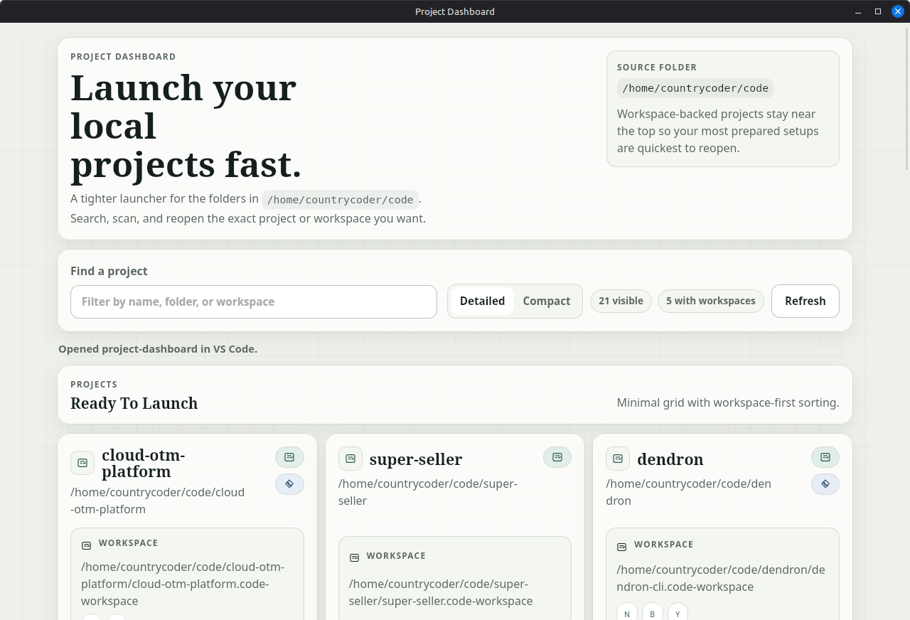

# Project Dashboard

Project Dashboard is a local-first desktop launcher for development folders. It scans a configurable project root, detects VS Code workspace files, and gives you a fast way to reopen projects, inspect git history, and keep the app available from the system tray.

Built with Tauri, TypeScript, and vanilla HTML/CSS.

## Features

- scan top-level project folders from a configurable local code root
- detect `.code-workspace` files in the project root or `.vscode/`
- open a project folder or workspace directly in VS Code
- show local tech hints for common stacks like Node, Rust, Python, Go, Java, .NET, and more
- browse local git branches and recent commit history in-app
- inspect commit details without leaving the launcher
- minimize to the system tray instead of quitting on window close
- refresh from the tray and optionally launch on login

## Defaults

- default project root: `~/code`
- VS Code launcher command: `code`

You can change the scanned root at runtime from the in-app settings dialog.

## Requirements

- Node.js 20+
- npm
- Rust toolchain via `rustup`
- VS Code CLI available as `code`
- Linux desktop dependencies required by Tauri

## Linux Dependencies

For Debian, Ubuntu, or Linux Mint, use the included helper script:

```bash
./install-linux-deps.sh
```

That installs common Tauri build dependencies and Rust if needed.

## Development

```bash
npm install
npm run tauri dev
```

The frontend build can be checked separately with:

```bash
npm run build
```

The Rust backend can be checked with:

```bash
cd src-tauri
cargo check
```

## Packaging

Build desktop bundles with:

```bash
npm run tauri build
```

Linux bundles are created under:

- `src-tauri/target/release/bundle/deb/`
- `src-tauri/target/release/bundle/rpm/`
- `src-tauri/target/release/bundle/appimage/`

On Debian-based systems, install or update with:

```bash
sudo apt install ./src-tauri/target/release/bundle/deb/project-dashboard_0.1.0_amd64.deb
```

## Screenshots

Add screenshots to a future `docs/` directory and reference them here before publishing the repository publicly.



## Tray Behavior

- closing the main window hides the app to the tray
- use the tray icon or tray menu to reopen it
- use the tray menu `Quit` item to fully exit
- the first tray hint dialog can be dismissed permanently with `Don't show this again`

## Repository Layout

- `src/` - frontend UI and app behavior
- `src-tauri/src/` - Rust backend commands and tray integration
- `src-tauri/tauri.conf.json` - Tauri app and bundle config
- `install-linux-deps.sh` - Debian/Ubuntu/Mint dependency bootstrap script

## License

MIT. See `LICENSE`.
